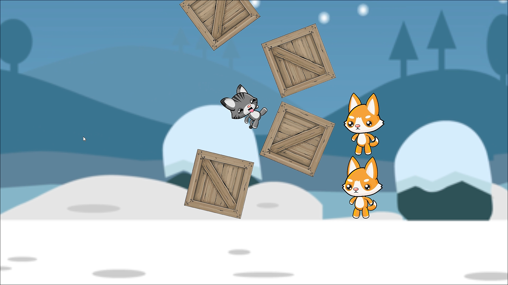

# Vindictive Cats

  
   

 

This is totally not a copy of Angry Birds. It is my second game created with Unity.
In this game, you have to launch a flying cat into the evil dogs protected by some crates.
Hit the dogs with your own body, or the crates to destroy them.

## Gameplay
The game has 2 levels for now. You have to drag the cat by clicking it. Then, release it
using the direction viewer to the dogs.

### Level 1
#### Beginning of Level 1

  
   

#### Dragging the Cat

  
   

#### Approaching the Dogs

  
   

#### Collision with a Dog

  
   

### Level 2
After the first level, you have to beat a harder level! TAKE THAT!

#### Beginning of Level 2

  
   

#### Approaching the Dogs

  
   

#### End of Level 2

  
   

## Credits
I have used free assets from:
1. <a href="https://opengameart.org">Open Game Art</a>  
2. <a href="https://www.gameart2d.com">Game Art 2D</a>  
3. <a href="https://pngtree.com">PNG Tree</a>  
